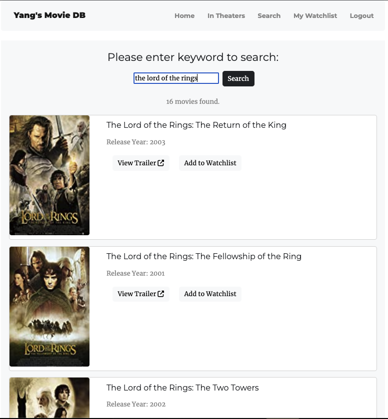

# A Simple IMDB App

## Summary
A simple IMDB information App that supports:
- user register, login and logout,
- Randomly show today's movie recommendation from IMDB 250 database on the homepage,
- Get latest movies in theathers (by calling IMDb API),
- Search movies by keyword (by calling IMDb API),
- Add favorite movies to personal watchlist, or remove movies from personal watchlist.
- (TBD) Watch trailers on Youtube(by calling YouTube API)

## Functions
### User register, login, logout

### Homepage and daily recommendation


### In Theaters


### Search Function


### Personal Watchlist


## To run this app in VS Code
(Reference: [Flask Tutorial in Visual Studio Code](https://code.visualstudio.com/docs/python/tutorial-flask)).

1. Prerequisites
   - python3 and python extension installed.

2. Create project environment for the Flask
    - use the following command to create and activate virtual environment named `.venv`
    ```
    # Linux
    sudo apt-get install python3-venv    # If needed
    python3 -m venv .venv
    source .venv/bin/activate

    # macOS
    python3 -m venv .venv
        source .venv/bin/activate

    # Windows
    py -3 -m venv .venv
    .venv\scripts\activate
    ```
3. Install dependencies `pip3 install -r requirements.txt`.
   
4. `flask run` to run the app on your local server.